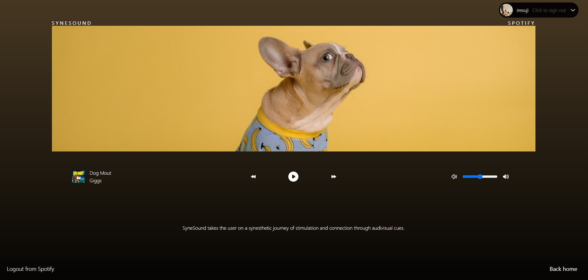

# Synesound App

The Synesound App is a unique multimedia application that uses synesthesia to create an immersive experience for the user. Synesthesia is a neurological phenomenon where stimulation of one sense leads to automatic, involuntary experiences in another sense. In this app, the colors extracted from an uploaded image are used to generate animations, visual effects, and music, creating a synesthetic experience for the user.


Users can upload an image, which is then analyzed to extract the dominant colors and objects. The colors are used to create synchronized animations and visual effects that accompany the music. The result is a personalized audio-visual experience that is tailored to the specific colors of the user's uploaded image.

The app requires of an active Spotify session on your computer.

Visit the working demo of Synesound at https://synesound.vercel.app/.



## Table of Contents

- Technologies and Libraries Used
- Features
- To-do features
- Environment Variables
- API Reference
- Deploye to Vercel
- Contributing
- License

## Technologies and Libraries Used

- [Next.JS 12](https://nextjs.org/)
- [TailwindCSS](https://tailwindcss.com/)
- [NextAuth.js](https://next-auth.js.org/) for Spotify OAuth authentication
- axios
- heroicons/react
- formidable
- framer-motion
- lodash
- primeicons
- primereact
- react-router-dom
- react-simple-typewriter
- react-transition-group
- recoil
- spotify-web-api-node
- typewriter-effect

## Features

- Discover new music based on the uploded image
- Sign up and log in to an account
- Play songs and control playback with a user-friendly player
- Logout from your account
- Upload image file from a local storage

## To-do features

- [ ] Additional player effects and animations
- [ ] Improved image recognition and matching songs
- [ ] Integration with additional music streaming services
- [ ] Mobile app development

## Environment Variables

To run this project localy, you will need to add the following environment variables to your .env file.

```bash
#Digital ocean spaces

DO_SPACES_ID=
DO_SPACES_SECRET=
DO_SPACES_URL=
DO_SPACES_BUCKET=

#Spotify

NEXTAUTH_URL=http://localhost:3000
NEXTAUTH_SECRET=

NEXT_PUBLIC_CLIENT_SECRET=
NEXT_PUBLIC_CLIENT_ID=
JWT_SECRET=
```

## API Reference

Synesound uses [Digital Ocean](https://try.digitalocean.com/cloud-storage/) to upload the image.

Synesound uses [Regim](https://rapidapi.com/rekinm-lnlYQT00U1z/api/regim3) to extract the colors and objects from the image.

Synesound uses [Spotify's developer dashboard](https://developer.spotify.com/dashboard/) for retrieving and play the songs.

## Deploye to Vercel

[Vercel Platform](https://vercel.com/new?utm_medium=default-template&filter=next.js&utm_source=create-next-app&utm_campaign=create-next-app-readme) from the creators of Next.js.

[Next.js deployment documentation](https://nextjs.org/docs/deployment) for more details.

## Contributing

If you're interested in contributing to the Synesthesia App, please contact us at. getsynesound@gmail.com

## License

The Synesthesia App is licensed under the MIT License. See [LICENSE](https://chat.openai.com/LICENSE) for more information.
